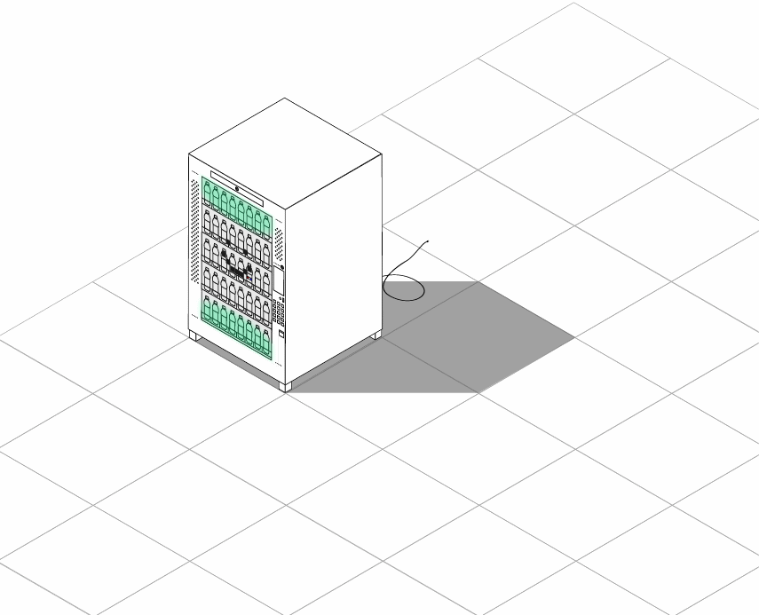

# Kernmodule Interaction Design 1

# Automotie
Automotie is een drankautomaat die de illusie geeft dat hij emotie heeft. 

Filmpje van hoe het prototype werkt:
LINK HIER!!!!!

De technische onderbouwing staat in de main directory.

# Huiswerk
Het normale huiswerk staat in het huiswerk mapje. In het docs mapje zijn de "Hoe zou je deze installatie bouwen" opdrachten te vinden.

